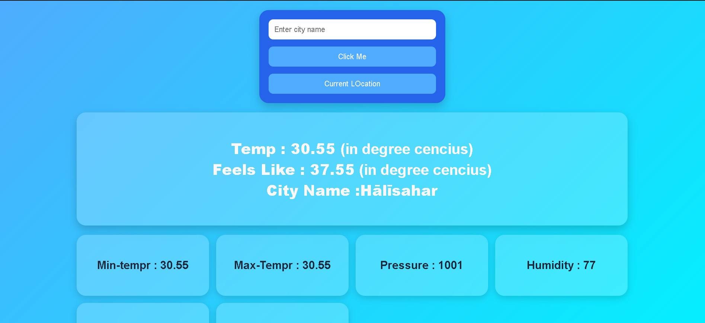

# Weather App 🌦️

A responsive weather application built using HTML, CSS, and JavaScript that fetches real-time weather data using the OpenWeather API.

---

## Features

- Search weather by city name
- Fetch current location weather using Geolocation API
- Real-time temperature data
- Displays:
  - Temperature
  - Feels Like
  - Min Temperature
  - Max Temperature
  - Humidity
  - Pressure
  - Sea Level
  - Ground Level
- Responsive UI using CSS Grid and Media Queries
- Modern glassmorphism design

---

## Technologies Used

- HTML5
- CSS3
- JavaScript (Vanilla JS)
- OpenWeather API

---

## Screenshots

Add your project screenshots here.


---

---

## Project Structure
Weather-App/
│
├── index.html
├── style.css
├── script.js
├── weather_icon.jpg
└── README.md


---

## How It Works

1. User enters city name OR allows location access
2. Browser fetches latitude and longitude using Geolocation API
3. OpenWeather API returns weather data
4. JavaScript dynamically updates the UI

---

## API Used

OpenWeather API:

https://openweathermap.org/api

---

## Setup Instructions

1. Clone the repository

```bash
git clone YOUR_REPOSITORY_LINK


2.Open project folder
   cd Weather-App
3.Add your OpenWeather API key inside script.js
  const apiKey = "YOUR_API_KEY";
4.Run the project using:
VS Code Live Server
OR
any local server


## Important Notes
Geolocation works properly on:
localhost
HTTPS websites
Some weather properties like:
sea_level
grnd_level

may not be available for all cities.

## Future Improvements
Add weather icons
Add 5-day forecast
Add dark mode
Add loading animation
Add weather background animations
Improve error handling

## Author

Ashok Samrat

## License

This project is open source and free to use. 
